# GitHub Analytics ELT Pipeline

End-to-end analytics engineering project built using GitHub data, Fivetran, BigQuery, dbt, and Looker Studio.

---

# Project Overview

This project demonstrates a modern ELT analytics workflow:

**GitHub API/Data ➧ Fivetran ➧ BigQuery ➧ dbt ➧ Looker Studio**

The architecture follows ELT approach where GitHub data is automatically extracted by Fivetran, loaded into BigQuery, transformed using dbt, and visualized through interactive Looker Studio dashboards.

The project analyzes GitHub repository, commit, and user activity data to create analytics-ready models, track engineering KPIs, and provide insights into repository performance and contributor engagement.

## Architecture Diagram

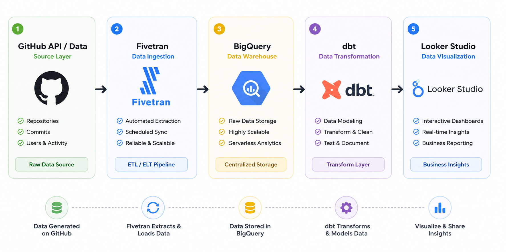

## Data Pipeline Architecture

The project follows a modern ELT architecture:

1. GitHub serves as the source system containing repository, commit, and user activity data.
2. Fivetran automatically extracts data from GitHub and loads it into BigQuery on a scheduled basis.
3. BigQuery stores the raw source data and acts as the central data warehouse.
4. dbt transforms raw data into clean, analytics-ready models using a layered architecture.
5. Looker Studio connects to the transformed models and provides business reporting dashboards.

---
## Step 1: GitHub API/Data Source

The source data for this project comes from the GitHub API. GitHub provides repository, commit, contributor, and user activity data through its API, making it a valuable source for engineering analytics and repository performance monitoring.

### Data Source

**Source System:** GitHub API

**Documentation:**
https://docs.github.com/en/rest

### GitHub API Data Model

The GitHub API provides several categories of repository and contributor data used throughout the analytics pipeline.

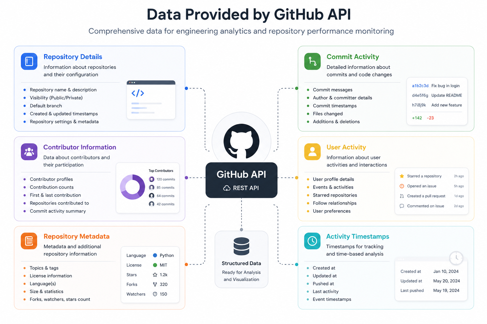

### Data Collected

The GitHub API provides information including:

* Repository details
* Commit activity
* Contributor information
* User activity
* Repository metadata
* Activity timestamps

In this project, Fivetran extracts GitHub data and loads it into BigQuery, where it becomes the foundation for downstream transformations and reporting.

### Project Objective

The goal of this project is to transform raw GitHub activity data into analytics-ready datasets that can be used to monitor:

* Repository activity
* Commit trends
* Contributor engagement
* Engineering productivity metrics

### Why GitHub Data?

GitHub contains rich operational data that is well suited for demonstrating modern analytics engineering workflows. It provides a realistic dataset for building an end-to-end ELT pipeline and showcasing data ingestion, transformation, testing, and reporting processes.

### GitHub Source Schema

The GitHub connector synchronizes multiple source tables, including:

* commit
* branch_commit_relation
* commit_check_run
* commit_file
* commit_parent
* repository
* user

These tables provide the raw data required for building analytics-ready models and dashboards.

### GitHub Source

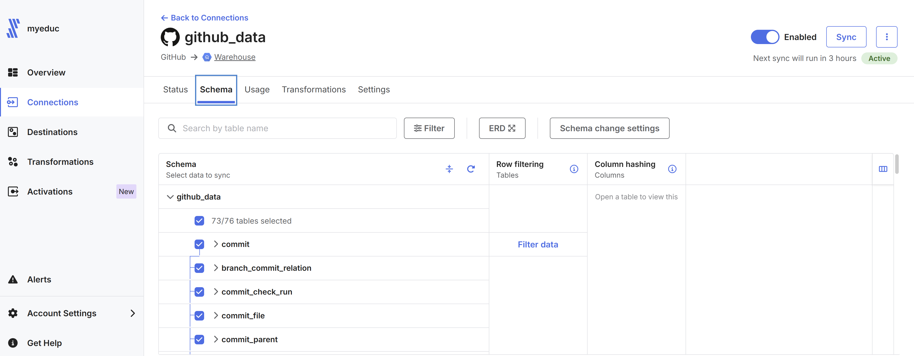


## Step 2: Data Ingestion with Fivetran

I used Fivetran to automate data ingestion from GitHub into BigQuery.

The GitHub connector extracts repository, commit, contributor, and user activity data and loads it into BigQuery without requiring custom ETL scripts.

### Connector Configuration

- Source: GitHub
- Destination: BigQuery
- Status: Active
- Sync Frequency: Every 6 Hours

Fivetran automatically detects new and updated records in GitHub and synchronizes them with BigQuery, ensuring that the analytics pipeline always uses current data.

### Fivetran Connector

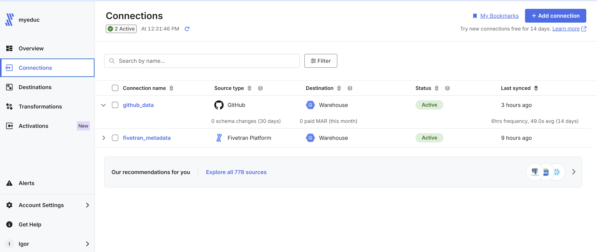

### Sync Monitoring

The connector runs automatically every 6 hours and provides monitoring for data extraction and loading operations. This schedule offers near real-time visibility into repository activity while minimizing unnecessary API requests and processing costs.

Depending on business requirements, data volume, and API usage limits, the sync frequency can be adjusted from 15 minutes to 24 hours.
  

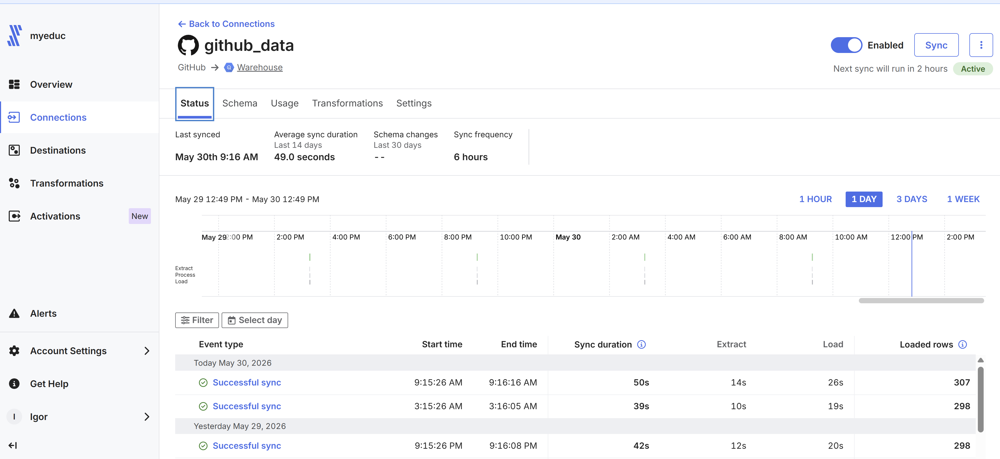


## Step 3: BigQuery Data Warehouse

BigQuery serves as the central data warehouse for this project. After connecting GitHub to Fivetran, all repository data is automatically loaded into BigQuery, where it is stored and prepared for transformation and analytics.

### BigQuery Dataset Architecture

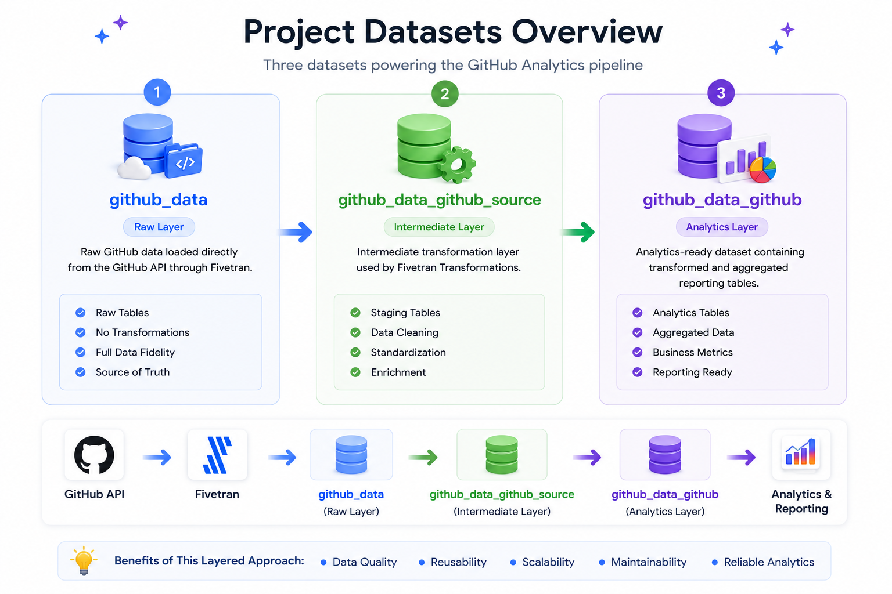

The project contains three BigQuery datasets that support different stages of the analytics pipeline:

| Dataset | Purpose |
|----------|----------|
| github_data | Raw GitHub data loaded directly from the GitHub API through Fivetran. |
| github_data_github_source | Intermediate transformation layer used by Fivetran Transformations. |
| github_data_github | Analytics-ready dataset containing transformed and aggregated reporting tables. |

### BigQuery Datasets

The project uses three datasets that represent different stages of the data pipeline.

#### 1. github_data (Raw Data Layer)

This dataset contains raw GitHub data loaded directly from Fivetran.

Examples of tables include:

* commit
* repository
* user
* issue
* pull_request
* repo_collaborator
* branch_commit_relation

These tables preserve the original structure of the GitHub source data and serve as the foundation for downstream transformations.

 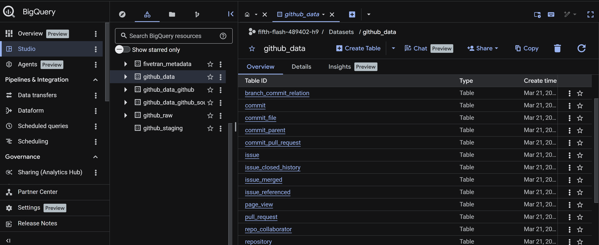

  

---

#### 2. github_data_github (Staging Layer)

This dataset contains staging tables used for intermediate transformations.

Examples of tables include:

* stg_github_issue
* stg_github_issue_comment
* stg_github_issue_closed_history
* stg_github_issue_merged
* stg_github_pull_request
* stg_github_pull_request_review

This layer standardizes, cleans, and prepares raw GitHub data before it is aggregated into reporting models.

 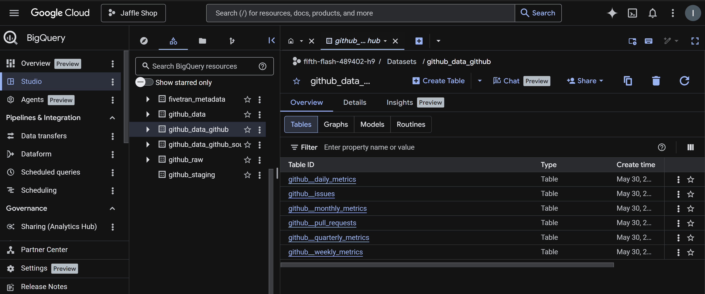  

---

#### 3. github_data_github_source (Analytics Layer)

This dataset contains analytics-ready tables designed for reporting and dashboarding.

Examples of tables include:

* github_daily_metrics
* github_weekly_metrics
* github_monthly_metrics
* github_quarterly_metrics
* github_issues
* github_pull_requests

These tables provide summarized metrics that help track repository activity, contributor engagement, issue management, and engineering productivity.
This layered architecture follows analytics engineering best practices by separating raw, staging, and analytics datasets, making the pipeline easier to maintain, test, and scale.

 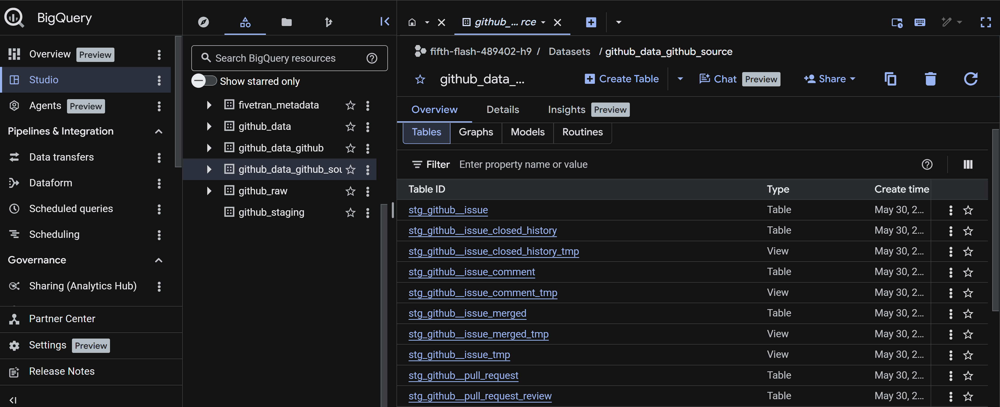  

### Data Flow

GitHub API → Fivetran → BigQuery (Raw Layer) → BigQuery (Staging Layer) → BigQuery (Analytics Layer) → dbt → Looker Studio

### Step 4: dbt Data Transformation

dbt is used to transform raw GitHub data into clean, tested, and analytics-ready models for reporting.

The transformation layer follows a structured modeling approach:

GitHub Raw Tables → Staging Models → Dimension Models → Fact Models → Analytics Dataset

### Transformation Flow

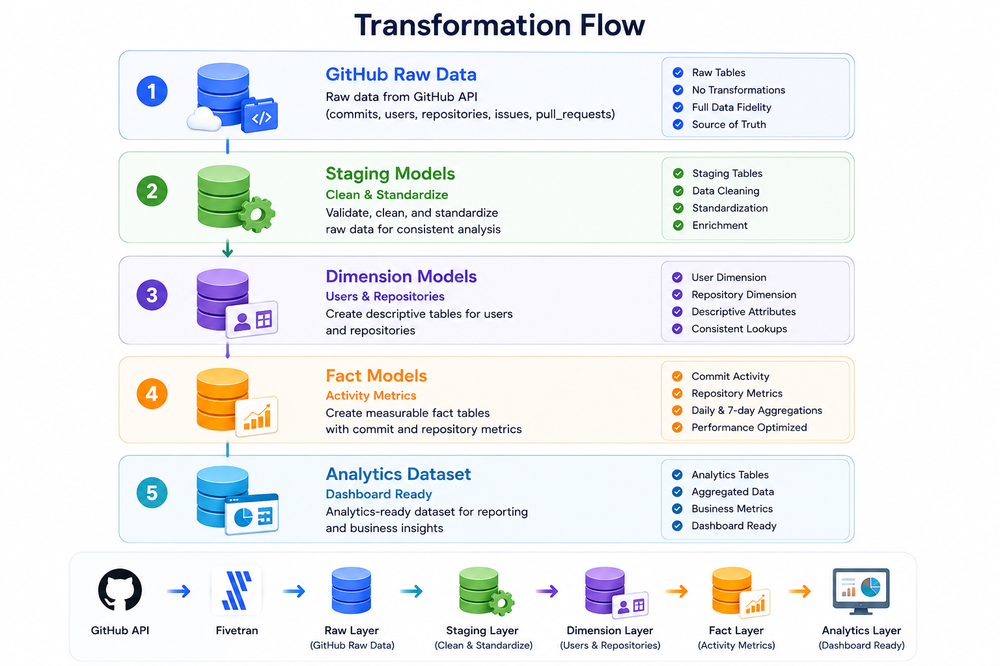

### dbt Project Structure

```text
models/
└── github_analytics_dbt/
    ├── staging/
    │   ├── stg_github__commit.sql
    │   ├── stg_github__repositories.sql
    │   └── stg_github__user.sql
    │
    └── marts/
        ├── dim_github__repositories.sql
        ├── dim_github__user.sql
        ├── fct_github_commit_activity.sql
        ├── fct_github_commit_activity_7d.sql
        ├── fct_repo_activity_daily.sql
        └── fct_daily_repo_stats.sql
```

### Source Layer

The source layer references raw GitHub tables loaded into BigQuery by Fivetran.

Main source tables:

- commit
- repository
- user
- issue
- pull_request

### Staging Layer

Staging models clean and standardize raw GitHub data before it is used in reporting models.

Examples:

- `stg_github__commit`
- `stg_github__repositories`
- `stg_github__user`

Key transformations include:

- Renaming columns
- Standardizing field names
- Converting data types
- Filtering unnecessary fields
- Preparing clean datasets for downstream models

### Dimension Models

Dimension models provide descriptive attributes for analysis.

Examples:

- `dim_github__repositories` — repository attributes and metadata
- `dim_github__user` — GitHub user and contributor attributes

### Fact Models

Fact models contain measurable events and metrics used for analysis and dashboards.

Examples:

- `fct_github_commit_activity` — commit activity metrics
- `fct_github_commit_activity_7d` — 7-day commit activity trends
- `fct_repo_activity_daily` — daily repository activity
- `fct_daily_repo_stats` — daily repository statistics

### dbt Lineage

The dbt lineage graph shows how raw GitHub source tables flow into staging models and then into analytics-ready fact and dimension tables.

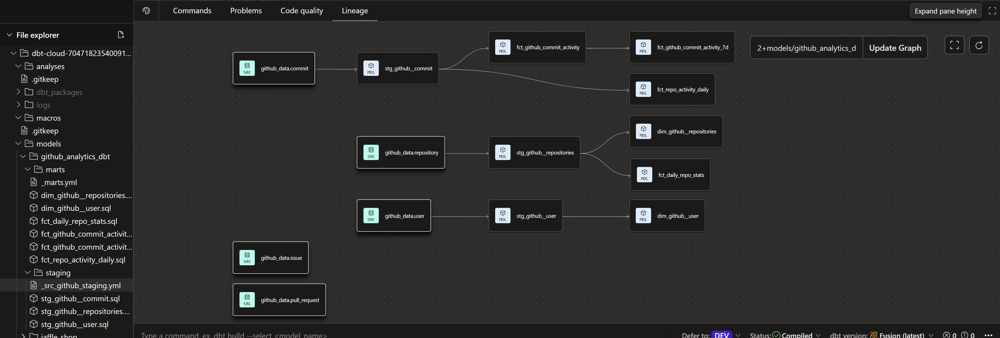

### Key dbt Code Examples

#### 1. Source Definition
This shows how dbt connects to your GitHub raw tables.
```File: _src_github_staging.yml

version: 2

sources:
  - name: github_data
    database: fifth-flash-489402-h9
    schema: github_data
    tables:
      - name: repository
      - name: commit
      - name: user
      - name: issue
      - name: pull_request

models:
  - name: stg_github__repositories
    description: "Cleaned repository data from GitHub"
    columns:
      - name: repository_id
        tests:
          - unique
          - not_null

  - name: stg_github__user
    description: "Cleaned GitHub user data"
    columns:
      - name: user_id
        tests:
          - unique
          - not_null

  - name: stg_github__commit
    description: "Cleaned GitHub commit data"
    columns:
      - name: commit_sha
        tests:
          - unique
          - not_null
```          

### Data Quality Tests

dbt tests are used to validate important fields and improve data reliability.

Implemented tests include:

- `unique`
- `not_null`

Example:

```_marts.yml
 name: dim_github__user
    description: "Dimension table for GitHub users"
    columns:
      - name: user_id
        description: "Primary key of user"
        tests:
          - unique
          - not_null


```

### Why dbt?

dbt was used because it supports:

- modular SQL transformations
- version-controlled analytics logic
- reusable models
- data quality testing
- clear lineage and documentation
- maintainable analytics engineering workflows

This dbt layer transforms raw GitHub activity data into reliable datasets that can be used for KPI reporting and dashboard development in Looker Studio.

### Step 5: Looker Studio Dashboard

The final step of the pipeline is data visualization using Looker Studio. The dashboard connects directly to the analytics-ready tables created by dbt and provides insights into repository performance, contributor activity, and commit trends.

## Dashboard Overview

The dashboard allows users to explore GitHub activity through interactive filters, KPI cards, trend analysis, and repository performance metrics.

### Dashboard Features

- Repository filtering
- Author filtering
- Date range selection
- Commit trend analysis
- Repository performance tracking
- Contributor activity monitoring
- Monthly commit analysis

### Key Performance Indicators (KPIs)

The dashboard displays:

- Total Commits
- Total Repositories
- Active Authors

### Analytics Views

#### Commit Activity Trend

Tracks commit volume over time and includes a 7-day moving average to identify activity patterns.

#### Top Repositories

Ranks repositories based on commit activity.

#### Top Authors

Identifies the most active contributors across repositories.

#### Commits by Author

Compares contribution levels between GitHub users.

#### Monthly Commit Distribution

Analyzes commit activity by month to identify seasonality and development trends.

## Dashboard Screenshot

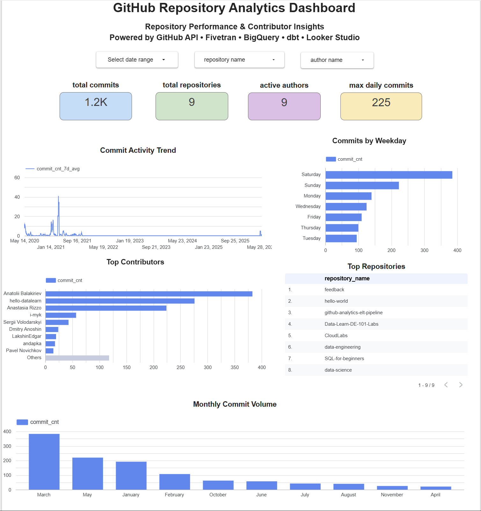

## Dashboard Data Sources

The dashboard is powered by dbt-generated analytics models:

- fct_github_commit_activity
- fct_github_commit_activity_7d
- fct_daily_repo_stats
- dim_github_repositories
- dim_github_user

## Business Value

This dashboard enables:

- Repository performance monitoring
- Contributor engagement analysis
- Engineering productivity tracking
- Activity trend identification
- Self-service reporting for development teams

# Looker Studio Dashboard

## Overview

The final step of the project was building an interactive dashboard in Looker Studio to visualize GitHub repository performance, contributor activity, and development trends.

The dashboard connects directly to BigQuery tables generated by dbt models and provides business-ready insights through interactive filters, KPI cards, and visualizations.

---

## Dashboard Architecture

```text
GitHub API
    ↓
Fivetran
    ↓
BigQuery
    ↓
dbt Models
    ↓
Looker Studio Dashboard
```

---

## Dashboard Features

### Filters

Users can dynamically filter dashboard results by:

- Date Range
- Repository Name
- Author Name

---

## KPI Metrics

### Total Commits
Displays the total number of commits across all repositories.

### Repositories
Displays the number of repositories included in the analysis.

### Active Contributors
Shows the number of unique contributors who made commits.

### Peak Daily Commits
Displays the highest number of commits recorded on a single day.

---

## Visualizations

### Monthly Commit Trend

Tracks commit activity over time and helps identify spikes and trends in development activity.

**Data Source:** `fct_github_commit_activity_7d`

**Metrics:**
- commit_cnt_7d_avg

**Dimension:**
- commit_date

---

### Commits by Weekday

Shows which days of the week have the highest development activity.

**Data Source:** `fct_github_commit_activity`

**Metric:**
- commit_cnt

**Dimension:**
- weekday_name

---

### Top Contributors

Ranks contributors by total commit volume.

**Data Source:** `fct_github_commit_activity`

**Metric:**
- commit_cnt

**Dimension:**
- author_name

---

### Top Repositories

Displays repositories with the highest activity levels.

**Data Source:** `fct_daily_repo_stats`

**Metric:**
- repo_count

**Dimension:**
- repository_name

---

### Monthly Commit Volume

Displays total commits aggregated by month.

**Data Source:** `fct_github_commit_activity`

**Metric:**
- commit_cnt

**Dimension:**
- commit_month

---

## Business Questions Answered

The dashboard helps answer the following questions:

- Which repositories are the most active?
- Who are the top contributors?
- How does commit activity change over time?
- Which months have the highest development activity?
- What day of the week has the highest development activity?
- What is the maximum number of commits made in a single day?

---

## Technologies Used

- GitHub API
- Fivetran
- BigQuery
- dbt
- Looker Studio

---

## Dashboard Screenshot


---

## Dashboard Development Process

### Step 1: Connect Analytics Models

Connected Looker Studio directly to BigQuery tables generated by dbt.

Data sources used:

- fct_github_commit_activity
- fct_github_commit_activity_7d
- fct_daily_repo_stats
- dim_github_repositories
- dim_github_user

These models provide clean, analytics-ready data for reporting.

---

### Step 2: Build KPI Scorecards

Created KPI cards to provide a high-level overview of repository activity.

Implemented metrics:

- Total Commits
- Total Repositories
- Active Contributors
- Peak Daily Commits

These KPIs allow users to quickly assess repository performance.

---

### Step 3: Add Interactive Filters

Added report-level controls to improve dashboard usability.

Filters include:

- Date Range
- Repository Name
- Author Name

These controls enable users to explore repository activity dynamically.

---

### Step 4: Create Analytical Visualizations

Developed visualizations to answer key business questions.

Implemented charts:

| Visualization | Purpose |
|--------------|---------|
| Commit Activity Trend | Analyze commit activity over time |
| Commits by Weekday | Identify peak development days |
| Top Contributors | Rank contributors by commit volume |
| Top Repositories | Identify the most active repositories |
| Monthly Commit Volume | Analyze monthly development trends |

---

### Step 5: Dashboard Design and Optimization

Applied dashboard design best practices to improve readability and user experience.

Enhancements include:

- Color-coded KPI cards
- Consistent chart sizing and alignment
- Interactive filtering
- Clear chart titles and labels
- Responsive layout
- Business-focused metrics

---

### Step 6: Data Validation

Validated dashboard results against BigQuery tables and dbt models to ensure metric accuracy and consistency.

Validation checks included:

- Commit totals
- Repository counts
- Contributor counts
- Aggregated metrics

---

### Result

Delivered an interactive GitHub Repository Analytics Dashboard that provides repository monitoring, contributor analysis, and development trend reporting through a centralized analytics platform built on BigQuery, dbt, and Looker Studio.

---

## Outcome

Built an end-to-end analytics solution that extracts GitHub data using Fivetran, transforms it using dbt in BigQuery, and visualizes repository and contributor performance in Looker Studio. The dashboard provides actionable insights into repository activity, contributor engagement, and development trends through interactive reporting.

---
