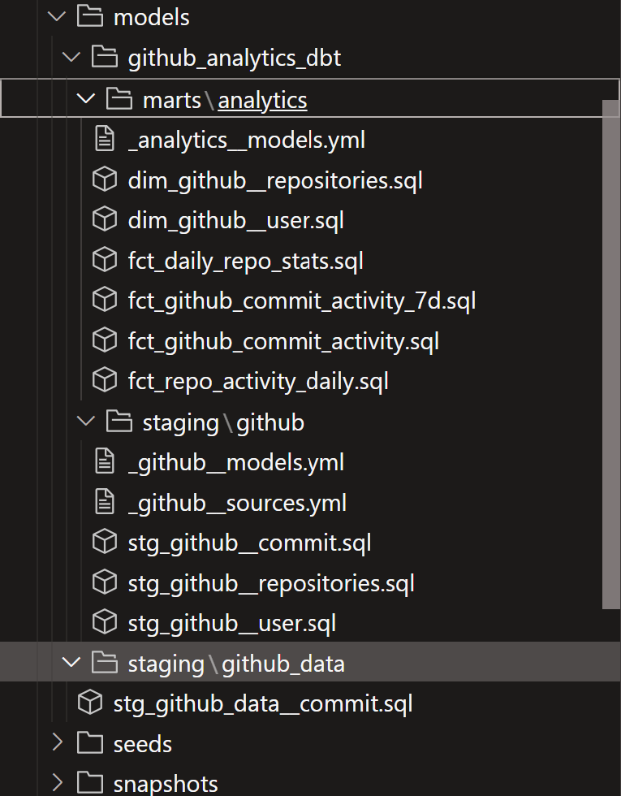
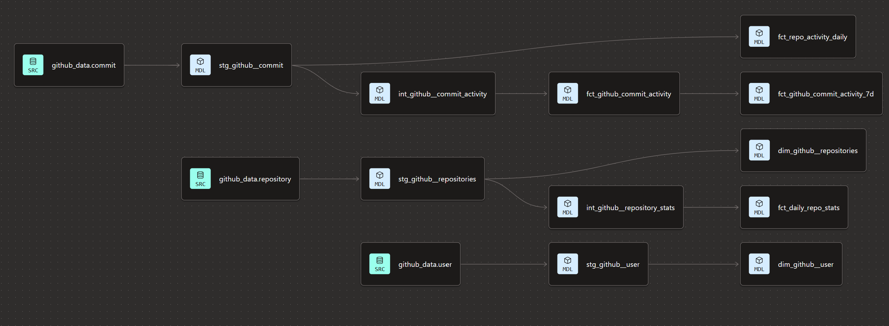

# GitHub Analytics ELT Pipeline

End-to-end analytics engineering project built using GitHub data, Fivetran, BigQuery, dbt, and Looker Studio.

---

# Project Overview

This project demonstrates a modern ELT analytics workflow:

**GitHub API/Data ➧ Fivetran ➧ BigQuery ➧ dbt ➧ Looker Studio**

The architecture follows ELT approach where GitHub data is automatically extracted by Fivetran, loaded into BigQuery, transformed using dbt, and visualized through interactive Looker Studio dashboards.

The project analyzes GitHub repository, commit, and user activity data to create analytics-ready models, track engineering KPIs, and provide insights into repository performance and contributor engagement.

## Architecture Diagram


## Data Pipeline Architecture

The project follows a modern ELT architecture:

1. GitHub serves as the source system containing repository, commit, and user activity data.
2. Fivetran automatically extracts data from GitHub and loads it into BigQuery on a scheduled basis.
3. BigQuery stores the raw source data and acts as the central data warehouse.
4. dbt transforms raw data into clean, analytics-ready models using a layered architecture.
5. Looker Studio connects to the transformed models and provides business reporting dashboards.


## dbt Project

The dbt models used in this ELT pipeline are maintained in a separate repository:

➡️ https://github.com/i-myk/github-analytics-dbt

The repository includes data transformations, data quality tests, and dbt documentation used by this project.


---
## Step 1: GitHub API/Data Source

The source data for this project comes from the GitHub API. GitHub provides repository, commit, contributor, and user activity data through its API, making it a valuable source for engineering analytics and repository performance monitoring.

### Data Source

**Source System:** GitHub API

**Documentation:**
https://docs.github.com/en/rest

### GitHub API Data Model

The GitHub API provides several categories of repository and contributor data used throughout the analytics pipeline.


### Data Collected

The GitHub API provides information including:

* Repository details
* Commit activity
* Contributor information
* User activity
* Repository metadata
* Activity timestamps

In this project, Fivetran extracts GitHub data and loads it into BigQuery, where it becomes the foundation for downstream transformations and reporting.

### Project Objective

The goal of this project is to transform raw GitHub activity data into analytics-ready datasets that can be used to monitor:

* Repository activity
* Commit trends
* Contributor engagement
* Engineering productivity metrics

### Why GitHub Data?

GitHub contains rich operational data that is well suited for demonstrating modern analytics engineering workflows. It provides a realistic dataset for building an end-to-end ELT pipeline and showcasing data ingestion, transformation, testing, and reporting processes.

### GitHub Source Schema

The GitHub connector synchronizes multiple source tables, including:

* commit
* branch_commit_relation
* commit_check_run
* commit_file
* commit_parent
* repository
* user

These tables provide the raw data required for building analytics-ready models and dashboards.

### GitHub Source


## Step 2: Data Ingestion with Fivetran

I used Fivetran to automate data ingestion from GitHub into BigQuery.

The GitHub connector extracts repository, commit, contributor, and user activity data and loads it into BigQuery without requiring custom ETL scripts.

### Connector Configuration

- Source: GitHub
- Destination: BigQuery
- Status: Active
- Sync Frequency: Every 6 Hours

Fivetran automatically detects new and updated records in GitHub and synchronizes them with BigQuery, ensuring that the analytics pipeline always uses current data.

### Fivetran Connector


### Sync Monitoring

The connector runs automatically every 6 hours and provides monitoring for data extraction and loading operations. This schedule offers near real-time visibility into repository activity while minimizing unnecessary API requests and processing costs.

Depending on business requirements, data volume, and API usage limits, the sync frequency can be adjusted from 15 minutes to 24 hours.
  


## Step 3: BigQuery Data Warehouse

Google BigQuery serves as the central data warehouse for this project. GitHub repository data is automatically extracted through Fivetran and loaded into BigQuery, where it is transformed into analytics-ready models using dbt.

### BigQuery Dataset Architecture

The project is organized into three logical layers that follow analytics engineering best practices.

| Dataset | Purpose |
|----------|---------|
| **github_data** | Raw GitHub data ingested from the GitHub API via Fivetran. |
| **dbt staging models** | Cleaned and standardized source data used for downstream transformations. |
| **dbt marts** | Business-ready fact and dimension models used for reporting and dashboarding. |

---

### 1. Raw Data Layer (`github_data`)

The raw dataset contains data automatically loaded from GitHub through Fivetran without modification.

Example source tables include:

- commit
- repository
- user
- issue
- pull_request
- repo_collaborator
- branch_commit_relation

These tables preserve the original GitHub schema and serve as the foundation for all dbt transformations.


---

### 2. dbt Staging Layer

The staging layer standardizes and cleans the raw GitHub data.

Main staging models:

- stg_github_commit
- stg_github_repositories
- stg_github_user

This layer applies column renaming, data cleaning, and consistent naming conventions before data moves to downstream models.


---

### 3. dbt Analytics Layer (Marts)

The marts layer contains analytics-ready fact and dimension models designed for business reporting and visualization.

Dimension Models

- dim_github_repositories
- dim_github_user

Fact Models

- fct_github_commit_activity
- fct_daily_repo_stats
- fct_github_commit_activity_7d
- fct_repo_activity_daily

These models power the Looker Studio dashboard and provide insights into:

- Repository activity
- Daily commit trends
- Active contributors
- Repository performance
- 7-day moving averages

This layered architecture separates raw, staging, and analytics models, making the project easier to maintain, test, document, and scale using dbt best practices.

**Screenshot:** BigQuery Analytics Models




# Step 4: dbt Data Transformation

dbt is used to transform raw GitHub data into clean, documented, and analytics-ready models for reporting and dashboarding.

The project follows a layered dbt architecture:

GitHub Raw Tables → Staging Models → Intermediate Models → Mart Models → Looker Studio Dashboard

---

## dbt Project Structure

```text
models/
└── github_analytics_dbt/
    ├── staging/
    │   └── github/
    │       ├── _github__sources.yml
    │       ├── _github__models.yml
    │       ├── stg_github__commit.sql
    │       ├── stg_github__repositories.sql
    │       └── stg_github__user.sql
    │
    ├── intermediate/
    │   └── github/
    │       ├── _intermediate__models.yml
    │       └── int_github_repository_stats.sql
    │
    └── marts/
        └── analytics/
            ├── _analytics__models.yml
            ├── dim_github__repositories.sql
            ├── dim_github__user.sql
            ├── fct_github_commit_activity.sql
            ├── fct_github_commit_activity_7d.sql
            ├── fct_repo_activity_daily.sql
            └── fct_daily_repo_stats.sql
```

---

## Source Layer

The source layer references raw GitHub data loaded into BigQuery by Fivetran.

Main source tables include:

- repository
- commit
- user

These source definitions provide a consistent entry point for downstream transformations.

---

## Staging Layer

The staging layer cleans and standardizes raw GitHub data.

Main staging models:

- stg_github__commit
- stg_github__repositories
- stg_github__user

Key transformations include:

- Renaming columns
- Standardizing naming conventions
- Cleaning data
- Selecting relevant fields
- Preparing datasets for downstream models

---

## Intermediate Layer

The intermediate layer applies reusable business logic before creating reporting models.

Main model:

- int_github_repository_stats

This layer simplifies complex transformations and prepares reusable datasets for the marts layer.

---

## Mart Layer

The marts layer contains analytics-ready fact and dimension models optimized for reporting.

### Dimension Models

- dim_github__repositories
- dim_github__user

### Fact Models

- fct_github_commit_activity
- fct_github_commit_activity_7d
- fct_repo_activity_daily
- fct_daily_repo_stats

These models power the Looker Studio dashboard and provide insights into:

- Repository activity
- Daily commit trends
- Active contributors
- Repository performance
- 7-day moving averages

---

## dbt Lineage

The dbt lineage graph illustrates how raw GitHub data flows through the staging, intermediate, and mart layers to create analytics-ready models.



---

## Data Quality

The project uses dbt tests to ensure data quality and maintain reliable analytical datasets.

Implemented tests:

- `unique`
- `not_null`

These tests validate primary business identifiers and help detect data quality issues during model execution.

Example:

```yaml
models:
  - name: dim_github__user
    description: "Dimension table for GitHub users"
    columns:
      - name: user_id
        description: "Primary key of the GitHub user"
        tests:
          - unique
          - not_null
```

---

## Documentation

The project includes YAML documentation for models, sources, and columns, making the transformation pipeline easier to understand, maintain, and extend.

---

## Why dbt?

dbt was selected because it enables:

- Modular SQL transformations
- Version-controlled analytics workflows
- Reusable data models
- Automated data quality testing
- Model documentation
- Clear data lineage

Using dbt transforms raw GitHub data into reliable, analytics-ready datasets that power the Looker Studio dashboard.


# Step 5: Looker Studio Dashboard

The final step of the pipeline is data visualization using Looker Studio.

The dashboard connects directly to the analytics-ready dbt models stored in BigQuery and provides interactive insights into repository activity, contributor engagement, and development trends.

---

## Dashboard Features

- Repository filter
- Author filter
- Date range filter
- KPI scorecards
- Commit trend analysis
- Repository performance
- Contributor activity
- Monthly commit analysis

---

## Key Performance Indicators (KPIs)

The dashboard tracks:

- Total Commits
- Total Repositories
- Active Contributors

---

## Dashboard Visualizations

### Commit Activity Trend

Displays commit activity over time with a 7-day moving average to highlight long-term trends.

### Top Repositories

Ranks repositories by commit activity.

### Top Contributors

Highlights the most active GitHub contributors.

### Commits by Contributor

Compares commit activity across contributors.

### Monthly Commit Distribution

Shows monthly commit trends to identify seasonality and development patterns.

---

## Dashboard Preview


## 🚀 Live Dashboard

🔗 **[View Interactive Looker Studio Dashboard](https://datastudio.google.com/reporting/7478f0af-71f2-464e-accb-4e4e010b19a9)**


## Key Insights

The dashboard helps engineering teams:

- Monitor repository health and development activity.
- Identify the most active repositories and contributors.
- Track development trends over time.
- Detect periods of increased or reduced engineering activity.
- Provide a single source of truth for repository analytics using dbt models.

## Overview

The final step of the project was building an interactive dashboard in Looker Studio to visualize GitHub repository performance, contributor activity, and development trends.

The dashboard connects directly to BigQuery tables generated by dbt models and provides business-ready insights through interactive filters, KPI cards, and visualizations.
