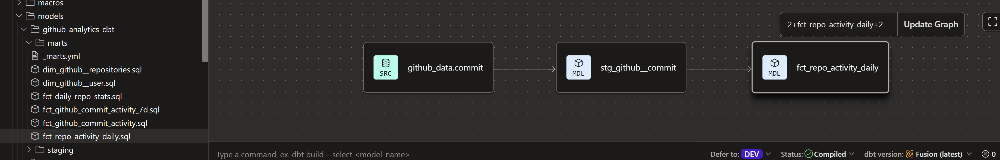
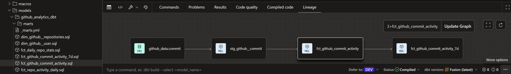
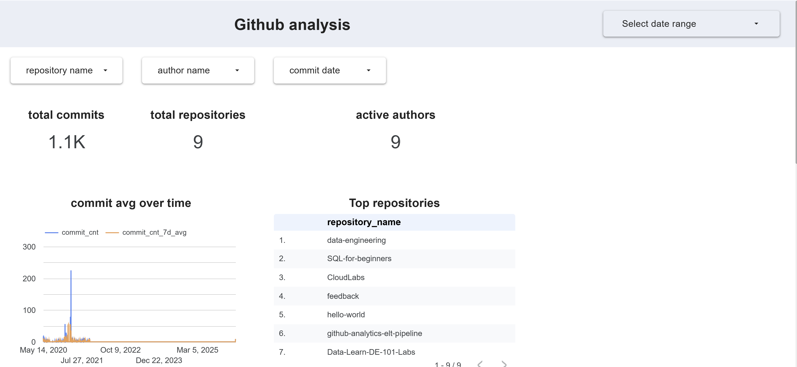
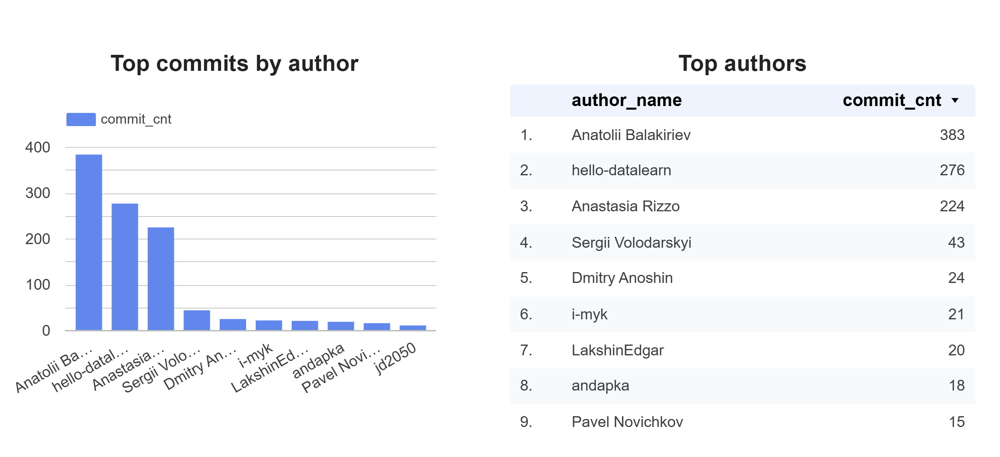
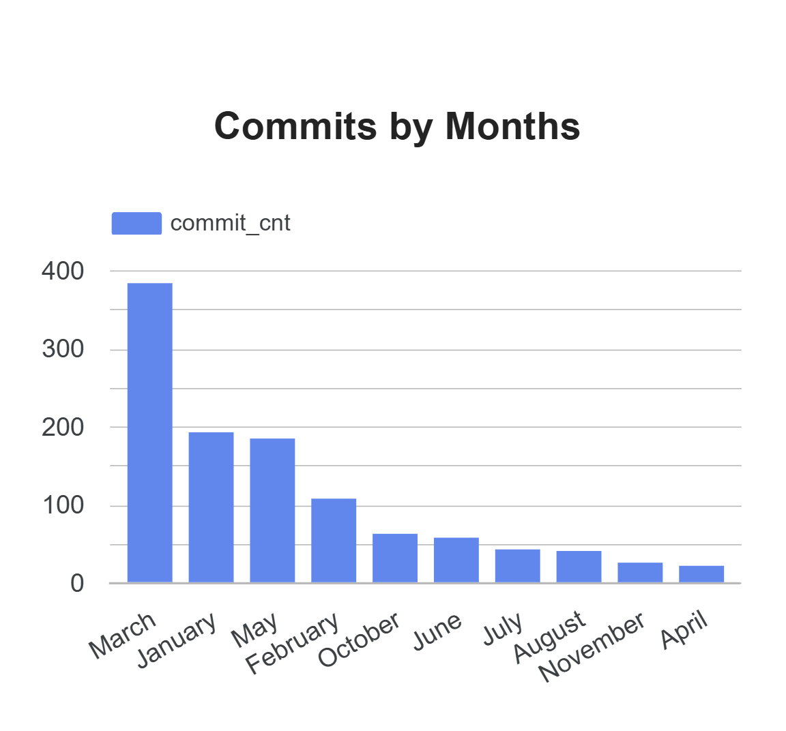

# GitHub Analytics ELT Pipeline

End-to-end analytics engineering project built using GitHub data, Fivetran, BigQuery, dbt, and Looker Studio.

---

# Project Overview

This project demonstrates a modern ELT analytics workflow:

**GitHub API/Data ➧ Fivetran ➧ BigQuery ➧ dbt ➧ Looker Studio**

The architecture follows ELT approach where GitHub data is automatically extracted by Fivetran, loaded into BigQuery, transformed using dbt, and visualized through interactive Looker Studio dashboards.

The project analyzes GitHub repository, commit, and user activity data to create analytics-ready models, track engineering KPIs, and provide insights into repository performance and contributor engagement.

## Architecture Diagram


## Data Pipeline Architecture

The project follows a modern ELT architecture:

1. GitHub serves as the source system containing repository, commit, and user activity data.
2. Fivetran automatically extracts data from GitHub and loads it into BigQuery on a scheduled basis.
3. BigQuery stores the raw source data and acts as the central data warehouse.
4. dbt transforms raw data into clean, analytics-ready models using a layered architecture.
5. Looker Studio connects to the transformed models and provides business reporting dashboards.

---
## Step 1: GitHub API/Data Source

The source data for this project comes from the GitHub API. GitHub provides repository, commit, contributor, and user activity data through its API, making it a valuable source for engineering analytics and repository performance monitoring.

### Data Source

**Source System:** GitHub API

**Documentation:**
https://docs.github.com/en/rest

### Data Collected

The GitHub API provides information including:

* Repository details
* Commit activity
* Contributor information
* User activity
* Repository metadata
* Activity timestamps

In this project, Fivetran extracts GitHub data and loads it into BigQuery, where it becomes the foundation for downstream transformations and reporting.

### Project Objective

The goal of this project is to transform raw GitHub activity data into analytics-ready datasets that can be used to monitor:

* Repository activity
* Commit trends
* Contributor engagement
* Engineering productivity metrics

### Why GitHub Data?

GitHub contains rich operational data that is well suited for demonstrating modern analytics engineering workflows. It provides a realistic dataset for building an end-to-end ELT pipeline and showcasing data ingestion, transformation, testing, and reporting processes.

### GitHub Source Schema

The GitHub connector synchronizes multiple source tables, including:

* commit
* branch_commit_relation
* commit_check_run
* commit_file
* commit_parent
* repository
* user

These tables provide the raw data required for building analytics-ready models and dashboards.

### GitHub Source


## Step 2: Data Ingestion with Fivetran

I used Fivetran to automate data ingestion from GitHub into BigQuery.

The GitHub connector extracts repository, commit, contributor, and user activity data and loads it into BigQuery without requiring custom ETL scripts.

### Connector Configuration

- Source: GitHub
- Destination: BigQuery
- Status: Active
- Sync Frequency: Every 6 Hours

Fivetran automatically detects new and updated records in GitHub and synchronizes them with BigQuery, ensuring that the analytics pipeline always uses current data.

### Fivetran Connector


### Sync Monitoring

### Sync Monitoring

The connector runs automatically every 6 hours and provides monitoring for data extraction and loading operations. This schedule offers near real-time visibility into repository activity while minimizing unnecessary API requests and processing costs.

Depending on business requirements, data volume, and API usage limits, the sync frequency can be adjusted from 15 minutes to 24 hours.
  


---

# Tech Stack

- BigQuery
- dbt
- Fivetran
- SQL
- Looker Studio
- GitHub

---

# Data Pipeline Architecture

1. Fivetran ingests GitHub data into BigQuery
2. dbt staging models clean and standardize raw data
3. dbt marts create analytics-ready fact and dimension tables
4. Looker Studio dashboards visualize repository activity and commit trends

---

# dbt Models

## Staging Models

- stg_github__commit
- stg_github__repositories
- stg_github__user

## Mart Models

- fct_github_commit_activity
- fct_github_commit_activity_7d
- fct_repo_activity_daily
- fct_daily_repo_stats
- dim_github__repositories
- dim_github__user

---

# Dashboard KPIs

- Total commits
- Active contributors
- Repository activity
- Daily commit trends
- 7-day moving average activity

---

# dbt Lineage

## Repository Activity Lineage



## Commit Activity Lineage



---

# Dashboard Screenshots

## Dashboard Example 1



## Dashboard Example 2


## Dashboard Example 3



---

# Key Skills Demonstrated

- ELT pipeline development
- Data modeling
- SQL transformations
- dbt development
- BigQuery analytics
- Dashboard development
- Analytics engineering
- KPI reporting
- Data warehouse concepts

---


## Data Quality Tests

This project uses dbt schema tests to improve data quality and validate important business fields.

Implemented tests include:

- `unique` → validates no duplicate primary keys
- `not_null` → ensures important fields are not empty

Example validations:

- `repository_id` must be unique and not null
- `user_id` must be unique and not null
- `stat_date` cannot be null

Example dbt test configuration:

```yaml
tests:
  - unique
  - not_null
```

Run tests with:

```bash
dbt test
```
